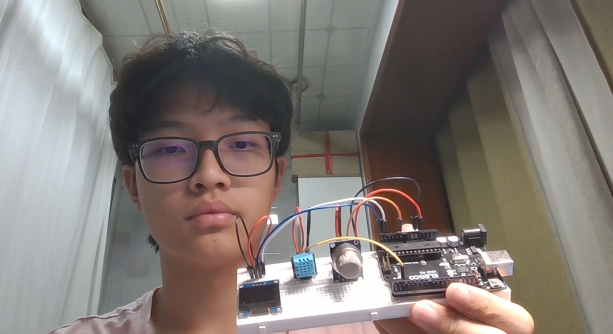

# Air Quality Tracker
For my project, I'm building an Air Quality Tracker that monitors environmental conditions and displays air quality data. The main components of my project include sensors, a microcontroller, a OLED display, and the Arduino IDE software used to collect and display the data. The sensors will measure environmental factors related to air quality, the microcontroller will process the sensor readings, and the OLED display displays the information received from the Arduino. 

| **Engineer** | **School** | **Area of Interest** | **Grade** |
|:--:|:--:|:--:|:--:|
| Junxi R | Cranbrook Schools | Electrical Engineering | Incoming Sophmore |


  
# Final Milestone (Modification)

<iframe width="560" height="315" src="https://www.youtube.com/embed/XSLnm3yMM8o?si=RQDdXt5oRMzgqEm0" title="Milestone 3" frameborder="0" allow="accelerometer; autoplay; clipboard-write; encrypted-media; gyroscope; picture-in-picture; web-share" allowfullscreen></iframe>

For my 3rd/Final Milestone, I worked on my modification. My modification was to create a simple website with a clean interface to display data from the Arduino IDE instead of viewing it from the OLED display. For this modification, I had to install python into my laptop. I then had to connect my Arduino R3 to the python installation through the python installation in my laptop Terminal (also known as Windows Powershell). I also had to use Windows Notepad (Notepad is a simple text editor that comes pre-installed on most Windows operating systems. It allows you to create and edit plain text files, such as notes, scripts, and hypertext markup language (HTML) code) to implement my CSS, Javascript, and HTML Code. This was all connected to the Arduino IDE and app.py (Python). 

The biggest challenge at BSE was probably my modification, because I had to troubleshoot many times to get my Arduino R3 to finally send data to the website. This was also the biggest achievements, as I never really used HTML, CSS, and Javascript before. It was quite cool to get the website to work. 

At Bluestamp, I learned how the breadboard, wires, sensors, displays, and microcontorller works. I also touched on many of the coding languages such as C++ for Arduino IDE, and HTML for my website. After BSE, I hope to implement my knowledge on sensors and data collection into future projects. I hope to learn more about designing my own PCB and learning schematics/circuits in a deeper level.

HTML, CSS, Javascript Code (Website code)

```
<!DOCTYPE html>
<html lang="en">
<head>
<meta charset="UTF-8">
    <meta name="viewport" content="width=device-width, initial-scale=1.0">
    <title>Dashboard</title>
    <script src="https://cdn.jsdelivr.net/npm/chart.js"></script>
    <style>
        /* Base page styles using a minimalist, dark theme */
        body {
            font-family: -apple-system, BlinkMacSystemFont, 'Segoe UI', Roboto, Helvetica, Arial, sans-serif;
            background-color: #000000;
            color: #ffffff;
            margin: 0;
            padding: 40px;
            display: flex;
            flex-direction: column;
            align-items: center;
            -webkit-font-smoothing: antialiased;
        }
        /* Centered content wrapper with a fixed maximum width */
        .main-container {
            max-width: 800px;
            width: 100%;
            display: flex;
            flex-direction: column;
            gap: 25px;
        }
        /* Header section with bottom border */
        header {
            display: flex;
            justify-content: space-between;
            align-items: baseline;
            border-bottom: 1px solid #222222;
            padding-bottom: 15px;
        }
        h1 {
            font-size: 20px;
            font-weight: 500;
            letter-spacing: -0.02em;
            margin: 0;
        }
        /* Subtitle style used for connection status */
        .subtitle {
            color: #666666;
            font-size: 12px;
            text-transform: uppercase;
            letter-spacing: 0.05em;
        }
        /* 4-column responsive layout grid for metrics cards */
        .grid {
            display: grid;
            grid-template-columns: repeat(4, 1fr);
            gap: 15px;
        }
        /* Individual metrics card design with hover transition effect */
        .card {
            background-color: #000000;
            border: 1px solid #222222;
            border-radius: 8px;
            padding: 20px;
            text-align: left;
            transition: transform 0.2s cubic-bezier(0.16, 1, 0.3, 1), border-color 0.2s ease;
        }
        .card:hover {
            transform: translateY(-2px);
            border-color: #ffffff;
        }
        .card h3 {
            margin: 0 0 12px 0;
            color: #666666;
            font-size: 11px;
            font-weight: 500;
            text-transform: uppercase;
            letter-spacing: 0.05em;
        }
        /* Large numerical value styling */
        .value {
            font-size: 28px;
            font-weight: 400;
            color: #ffffff;
            letter-spacing: -0.03em;
        }
        /* Measurement unit label styling */
        .unit {
            font-size: 14px;
            color: #666666;
            margin-left: 2px;
        }
        /* Container elements to bound Chart.js canvas elements */
        .chart-container {
            background-color: #000000;
            border: 1px solid #222222;
            border-radius: 8px;
            padding: 20px;
            height: 200px; /* Slightly shorter to stack nicely */
            width: 100%;
            box-sizing: border-box;
        }
    </style>
</head>
<body>

    <div class="main-container">
        <header>
            <h1>Environment Monitor</h1>
            <div class="subtitle" id="system-status">Live Connection</div>
        </header>

        <div class="grid">
            <div class="card">
                <h3>Gas Level</h3>
                <div class="value" id="gas-val">0</div>
            </div>
            <div class="card">
                <h3>Air Quality</h3>
                <div class="value" id="quality-val" style="color: #ffffff;">—</div>
            </div>
            <div class="card">
                <h3>Temperature</h3>
                <div class="value"><span id="temp-val">0</span><span class="unit">&deg;C</span></div>
            </div>
            <div class="card">
                <h3>Humidity</h3>
                <div class="value"><span id="humidity-val">0</span><span class="unit">%</span></div>
            </div>
        </div>

        <div class="chart-container">
            <canvas id="tempChart"></canvas>
        </div>

        <div class="chart-container">
            <canvas id="gasChart"></canvas>
        </div>
    </div>

    <script>
        // Global limits and tracking variables for chart rendering
        const maxDataPoints = 25;
        const labels = [];
        const tempData = [];
        const gasData = [];

        // Cache variables to store current values fetched from server
        let currentTemp = 0;
        let currentGas = 0;

        // Shared baseline options for structural minimalism
        const commonOptions = {
            responsive: true,
            maintainAspectRatio: false,
            scales: {
                x: {
                    grid: { color: '#111111' },
                    ticks: { color: '#444444', font: { size: 10 } }
                },
                y: {
                    grid: { color: '#111111' },
                    ticks: { color: '#666666', font: { size: 10 } }
                }
            },
            plugins: {
                legend: {
                    position: 'top',
                    align: 'end',
                    labels: { color: '#999999', boxWidth: 12, font: { size: 11 } }
                }
            }
        };

        // Initialize Pure White Temperature Graph
        const tempChartCtx = document.getElementById('tempChart').getContext('2d');
        const tempChart = new Chart(tempChartCtx, {
            type: 'line',
            data: {
                labels: labels,
                datasets: [{
                    label: 'Temperature (°C)',
                    data: tempData,
                    borderColor: '#ffffff',
                    backgroundColor: 'transparent',
                    borderWidth: 2,
                    tension: 0.1,
                    pointRadius: 0,
                    pointHoverRadius: 4
                }]
            },
            options: commonOptions
        });

        // Initialize Dashed Gray Gas Level Graph
        const gasChartCtx = document.getElementById('gasChart').getContext('2d');
        const gasChart = new Chart(gasChartCtx, {
            type: 'line',
            data: {
                labels: labels,
                datasets: [{
                    label: 'Gas Level',
                    data: gasData,
                    borderColor: '#666666',
                    backgroundColor: 'transparent',
                    borderWidth: 1.5,
                    borderDash: [4, 4],
                    tension: 0.1,
                    pointRadius: 0,
                    pointHoverRadius: 4
                }]
            },
            options: commonOptions
        });

        // Loop 1: Text updates run every 1 second
        // Fetches JSON payload from backend and injects values into DOM elements
        function updateStatsText() {
            fetch('/data')
                .then(response => response.json())
                .then(data => {
                    document.getElementById('gas-val').innerText = data.gas;
                    document.getElementById('quality-val').innerText = data.quality;
                    document.getElementById('temp-val').innerText = data.temp;
                    document.getElementById('humidity-val').innerText = data.humidity;
                    
                    // Cache numerical values to be used by the charting loop
                    currentTemp = parseFloat(data.temp);
                    currentGas = parseFloat(data.gas);
                })
                .catch(err => console.error('Error fetching data:', err));
        }

        // Loop 2: Both charts log a new tracking line position every 5 seconds
        // Keeps history arrays bound to a max size and triggers chart redrawing
        function logGraphPoints() {
            const currentTime = new Date().toLocaleTimeString([], { hour: '2-digit', minute: '2-digit', second: '2-digit' });
            
            // Push newest records into arrays
            labels.push(currentTime);
            tempData.push(currentTemp);
            gasData.push(currentGas);

            // Evict oldest elements if max dynamic threshold is breached
            if (labels.length > maxDataPoints) {
                labels.shift();
                tempData.shift();
                gasData.shift();
            }

            // Request instance updates from Chart.js API
            tempChart.update();
            gasChart.update();
        }

        // Initial setup and loop schedules execution triggering
        updateStatsText();
        setInterval(updateStatsText, 1000);

        logGraphPoints();
        setInterval(logGraphPoints, 5000); // 5 seconds
    </script>
</body>
</html>
```

Python Code

```
import serial
import threading
import time
import re
from flask import Flask, jsonify, render_template_string

app = Flask(__name__)

# This holds the data that the website will read
latest_data = {"gas": "0", "quality": "Initializing", "temp": "0", "humidity": "0"}

import serial
import threading
import time
import re
from flask import Flask, jsonify, render_template_string

app = Flask(__name__)

# This holds the data that the website will read
latest_data = {"gas": "0", "quality": "Initializing", "temp": "0", "humidity": "0"}

def read_from_serial():
    global latest_data
    
    # COM Port Verification
    arduino_port = 'COM3' 
    
    try:
        print(f"[SERIAL] Attempting to open physical connection on {arduino_port}...")
        ser = serial.Serial(arduino_port, 9600, timeout=1)
        
        print("[SERIAL] Connection initiated. Waiting 2 seconds for hardware to settle...")
        time.sleep(2) 
        print(f"[SERIAL] SUCCESS: Connected to Arduino on {arduino_port}!")
        
        while True:
            if ser.in_waiting > 0:
                line = ser.readline().decode('utf-8', errors='ignore').strip()
                
                if "DATA -> Gas:" in line:
                    try:
                        # Extract data
                        gas_match = re.search(r"Gas:\s*(\d+)", line)
                        quality_match = re.search(r"Quality:\s*([a-zA-Z\s]+)", line)
                        temp_match = re.search(r"Temp:\s*(\d+)", line)
                        humidity_match = re.search(r"Humidity:\s*(\d+)", line)
                        
                        if gas_match and quality_match and temp_match and humidity_match:
                            # re.sub(r'[^0-9]', '', ...) strips away ANY character 
                            # that isn't a pure number (0-9), entirely destroying the hidden 'A' artifact.
                            clean_gas = re.sub(r'[^0-9]', '', gas_match.group(1))
                            clean_temp = re.sub(r'[^0-9]', '', temp_match.group(1))
                            clean_humidity = re.sub(r'[^0-9]', '', humidity_match.group(1))
                            
                            # Update our global dictionary with clean, pure data values
                            latest_data["gas"] = clean_gas
                            latest_data["quality"] = quality_match.group(1).strip()
                            latest_data["temp"] = clean_temp
                            latest_data["humidity"] = clean_humidity
                            
                    except Exception as parse_error:
                        print(f"[PARSING ERROR]: Failed to break down line. {parse_error}")
                        
    except Exception as e:
        print(f"\n[SERIAL ERROR]: {e}")
        print("[SERIAL WARNING]: Python could not open COM3. Your dashboard website will still start up, but sensor data won't update until the port is cleared.\n")

@app.route('/')
def home():
    try:
        with open("index.html", "r") as f:
            return render_template_string(f.read())
    except FileNotFoundError:
        return "<h1>Error: index.html not found in this folder!</h1>", 404

@app.route('/data')
def get_data():
    return jsonify(latest_data)

if __name__ == '__main__':
    print("[SYSTEM] Starting background thread for Arduino monitoring...")
    threading.Thread(target=read_from_serial, daemon=True).start()
    
    print("[SYSTEM] Launching Flask development server...")
    app.run(debug=True, use_reloader=False, port=5000)
```

# Second Milestone

<iframe width="560" height="315" src="https://www.youtube.com/embed/kvPx3nTmNkU?si=kUgXUyrPYYAEh5bY" title="Milestone 2" frameborder="0" allow="accelerometer; autoplay; clipboard-write; encrypted-media; gyroscope; picture-in-picture; web-share" allowfullscreen></iframe>

For my second milestone, I completed the circuit/hardware and made some additional tweaks in the code to optimize performance. It's suprising on how much I learned about the code just during the first week. I'm also glad that I finished the hardware quite fast. A challenge I had was extra pixels showing up at the bottom of the OLED screen. This happened because the Arduino was running out of temporary memory (RAM) from using heavy String variables. To fix this, I changed the code to use lightweight const char* text variables instead. This saved a lot of memory space and made the extra pixels disappear. I also realised in this process that the data was not showing up in the Serial Monitor. I found out that the base code did not implement the actual Serial.print() commands needed to send the sensor numbers down the USB cable to the computer. Before my final milestone, I will need to work on my modification.


# First Milestone

<iframe width="560" height="315" src="https://www.youtube.com/embed/Tj5ji4B5pC4?si=usghbH-rL_BH7Lqv" title="Milestone 2" frameborder="0" allow="accelerometer; autoplay; clipboard-write; encrypted-media; gyroscope; picture-in-picture; web-share" allowfullscreen></iframe>

So far, I have worked on creating the circuit schematics in Tinkercad and putting the code into the IDE. Using Tinkercad has allowed me to test the design virtually before building the physical prototype. I have also begun my hardware. One challenge I was facing during the first week is the code that wasn't working on Tinkercad, and not being able to test the code, as I didn't have my actual parts. To complete my project, I will finish assembling the hardware and test the system under different conditions

# Schematics 


# Code

Original Code (base code from Arduino website with a few tweaks)

```c++
#include <SPI.h>
#include <Wire.h>
#include <Adafruit_GFX.h>
#include <Adafruit_SSD1306.h>

// --- ADAFRUIT DHT LIBRARY CONFIGURATION ---
#include "DHT.h"
#define DHT11PIN 2
#define DHTTYPE DHT11    
DHT dht(DHT11PIN, DHTTYPE); 
// ------------------------------------------

#define SCREEN_WIDTH 128 
#define SCREEN_HEIGHT 64 
#define OLED_RESET     4  
Adafruit_SSD1306 display(SCREEN_WIDTH, SCREEN_HEIGHT, &Wire, OLED_RESET);

#define sensor    A0 
int gasLevel  = 0;         
String quality =""; 

void sendSensor()
{
  float h = dht.readHumidity();
  float t = dht.readTemperature(); // This defaults to Celsius
  
  if (isnan(h) || isnan(t)) {
    Serial.println("Failed to read from DHT sensor!");
    return;
  }
  
  display.setTextColor(WHITE);
  display.setTextSize(1); // CHANGED: Set to standard, clean Size 1 to prevent text overlap
  
  // --- TEMPERATURE ROW ---
  // CHANGED: Moved Y-coordinate to 36 to leave a clean gap under the MQ135 values
  display.setCursor(0, 36); 
  display.print("Temp: ");
  display.print((int)t);     
  display.println(" C");

  // --- HUMIDITY ROW ---
  // CHANGED: Moved Y-coordinate to 50 so it sits cleanly at the bottom of the screen
  display.setCursor(0, 50); 
  display.print("RH:   ");
  display.print((int)h);     
  display.println(" %");
}

void air_sensor()
{
  gasLevel = analogRead(sensor);
  if(gasLevel < 151){
    quality = "Good";
  }
  else if (gasLevel >= 151 && gasLevel < 200){
    quality = "Poor";
  }
  else if (gasLevel >= 200 && gasLevel < 300){
    quality = "Bad";
  }
  else if (gasLevel >= 300 && gasLevel < 500){
    quality = "Toxic!";
  }
  else{
    quality = "Toxic!";   
  }

  display.setTextColor(WHITE);
  display.setTextSize(1); // CHANGED: Using Size 1 for line spacing
  
  // --- AIR QUALITY LINE ---
  // CHANGED: Positioned at the absolute top (Y=2) so nothing cuts it off
  display.setCursor(0, 2);
  display.print("Air Quality: "); 
  display.println(quality);       

  // --- RAW VALUE LINE ---
  // CHANGED: Set Y-coordinate to 16 to sit exactly one row below "Air Quality"
  display.setCursor(0, 16);
  display.print("Value:       ");       
  display.println(gasLevel);      
}

void setup() {
  Serial.begin(9600);
  pinMode(sensor, INPUT);
  
  dht.begin(); 
  
  if(!display.begin(SSD1306_SWITCHCAPVCC, 0x3c)) { 
    Serial.println(F("SSD1306 allocation failed"));
  }
  
  // --- INTRO SCREEN ---
  display.clearDisplay();
  display.setTextColor(WHITE);
  display.setTextSize(2);
  display.setCursor(45, 10);
  display.println("Air");
  display.setTextSize(1);
  display.setCursor(20, 35);
  display.println("Quality Monitor");
  display.setCursor(40, 50);
  display.println("BY JUNXI"); 
  display.display();
  delay(2000); 
  display.clearDisplay();    
}

void loop() {
  display.clearDisplay();
  air_sensor();
  sendSensor();
  display.display();  
  delay(2000); 
}

```

New Code (updated finalized code that is compatible with Python)

```c++
#include <SPI.h>
#include <Wire.h>
#include <Adafruit_GFX.h>
#include <Adafruit_SSD1306.h>

// --- ADAFRUIT DHT LIBRARY CONFIGURATION ---
#include "DHT.h"
#define DHT11PIN 2
#define DHTTYPE DHT11    
DHT dht(DHT11PIN, DHTTYPE); 

#define SCREEN_WIDTH 128 
#define SCREEN_HEIGHT 64 
#define OLED_RESET     4  
Adafruit_SSD1306 display(SCREEN_WIDTH, SCREEN_HEIGHT, &Wire, OLED_RESET);

#define sensor    A0 
int gasLevel  = 0;         

// --- FIXED: Replaced string object with text arrays ---
const char* quality = "Good"; 

// --- GLOBAL VARIABLES ---
float globalTemp = 0.0;
float globalHumidity = 0.0;
unsigned long lastDHTRead = 0;

void sendSensor()
{
  if (millis() - lastDHTRead >= 2500) {
    lastDHTRead = millis();
    
    float h = dht.readHumidity();
    float t = dht.readTemperature(); 
    
    if (!isnan(h) && !isnan(t)) {
      globalHumidity = h;
      globalTemp = t;
    }
  }
  
  display.setTextColor(WHITE);
  display.setTextSize(1); 
  
  display.setCursor(0, 34); 
  display.print(F("Temp: ")); // FIXED: Added F() save RAM, which essentially removed the residual pixels from OLED screen
  display.print((int)globalTemp);     
  display.println(F(" C"));

  display.setCursor(0, 48); 
  display.print(F("RH:   "));
  display.print((int)globalHumidity);     
  display.println(F(" %"));
}

void air_sensor()
{
  gasLevel = analogRead(sensor);
  if(gasLevel < 151){
    quality = "Good";
  }
  else if (gasLevel >= 151 && gasLevel < 200){
    quality = "Poor";
  }
  else if (gasLevel >= 200 && gasLevel < 300){
    quality = "Bad";
  }
  else{
    quality = "Toxic!";   
  }

  display.setTextColor(WHITE);
  display.setTextSize(1); 
  
  display.setCursor(0, 2);
  display.print(F("Air Quality: ")); 
  display.println(quality);       

  display.setCursor(0, 16);
  display.print(F("Value:       "));       
  display.println(gasLevel);      
}

void setup() {
  Serial.begin(9600); 
  delay(1000); 
  Serial.println(F("--- System Starting Up ---"));
  
  pinMode(sensor, INPUT);
  dht.begin(); 
  
  // Initialize the screen hardware profile
  display.begin(SSD1306_SWITCHCAPVCC, 0x3C); 
  
  display.clearDisplay();
  display.display();
  delay(100);
}

void loop() {
  display.clearDisplay();
  
  air_sensor();
  sendSensor();
  
  //Python reads code easier when they are spaced out with commas instead
  Serial.print(gasLevel);
  Serial.print(",");
  Serial.print(quality);
  Serial.print(",");
  Serial.print((int)globalTemp);
  Serial.print(",");
  Serial.println((int)globalHumidity); // Used println on the last one for a new line
  
  
  display.display();  
  delay(4000); // Interval between each piece of data sent to the OLED screen
}

```

# Bill of Materials

| **Part** | **Description** | **Price** | **Link** |
|:--:|:--:|:--:|:--:|
| Arduino UNO R3 | Microcontroller that processes data from the sensors | $16.99 | <a href="https://www.amazon.com/Arduino-A000066-ARDUINO-UNO-R3/dp/B008GRTSV6/"> Link </a> |
| Temperature & Humidity Sensor | Receives temperature/humidity | $1.99 | <a href="https://www.amazon.com/Teyleten-Robot-Temperature-Humidity-Raspberry/dp/B0CPF6ZZ73/"> Link </a> |
| Gas Sensor | Air Quality Sensor | $2.99 | <a href="https://www.amazon.com/dp/B07L73VTTY"> Link </a> |
| 12C OLED Display | Displays data received by the Arduino from the sensors | $3.33 | <a href="https://www.amazon.com/dp/B0D2RMQQHR/"> Link </a> |
