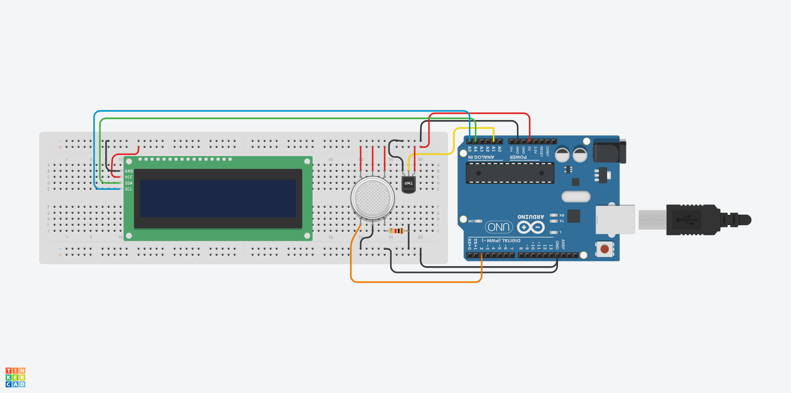

# Air Quality Tracker
Replace this text with a brief description (2-3 sentences) of your project. This description should draw the reader in and make them interested in what you've built. You can include what the biggest challenges, takeaways, and triumphs from completing the project were. As you complete your portfolio, remember your audience is less familiar than you are with all that your project entails!

You should comment out all portions of your portfolio that you have not completed yet, as well as any instructions:
```HTML 
<!--- This is an HTML comment in Markdown -->
<!--- Anything between these symbols will not render on the published site -->
```

| **Engineer** | **School** | **Area of Interest** | **Grade** |
|:--:|:--:|:--:|:--:|
| Junxi R | Cranbrook Schools | Electrical Engineering | Incoming Sophmore |

**Replace the BlueStamp logo below with an image of yourself and your completed project. Follow the guide [here](https://tomcam.github.io/least-github-pages/adding-images-github-pages-site.html) if you need help.**


  
# Final Milestone

**Don't forget to replace the text below with the embedding for your milestone video. Go to Youtube, click Share -> Embed, and copy and paste the code to replace what's below.**

<iframe width="560" height="315" src="https://www.youtube.com/embed/F7M7imOVGug" title="YouTube video player" frameborder="0" allow="accelerometer; autoplay; clipboard-write; encrypted-media; gyroscope; picture-in-picture; web-share" allowfullscreen></iframe>

For your final milestone, explain the outcome of your project. Key details to include are:
- What you've accomplished since your previous milestone
- What your biggest challenges and triumphs were at BSE
- A summary of key topics you learned about
- What you hope to learn in the future after everything you've learned at BSE


# Second Milestone

**Don't forget to replace the text below with the embedding for your milestone video. Go to Youtube, click Share -> Embed, and copy and paste the code to replace what's below.**

<iframe width="560" height="315" src="https://www.youtube.com/embed/y3VAmNlER5Y" title="YouTube video player" frameborder="0" allow="accelerometer; autoplay; clipboard-write; encrypted-media; gyroscope; picture-in-picture; web-share" allowfullscreen></iframe>

For your second milestone, explain what you've worked on since your previous milestone. You can highlight:
- Technical details of what you've accomplished and how they contribute to the final goal
- What has been surprising about the project so far
- Previous challenges you faced that you overcame
- What needs to be completed before your final milestone 

# First Milestone

**Don't forget to replace the text below with the embedding for your milestone video. Go to Youtube, click Share -> Embed, and copy and paste the code to replace what's below.**

<iframe width="560" height="315" src="https://www.youtube.com/embed/CaCazFBhYKs" title="YouTube video player" frameborder="0" allow="accelerometer; autoplay; clipboard-write; encrypted-media; gyroscope; picture-in-picture; web-share" allowfullscreen></iframe>

For my project, I am building an Air Quality Tracker that monitors environmental conditions and displays air quality data. 

The main components of my project include sensors, a microcontroller, a OLED display, and the Arduino IDE software used to collect and display the data. The sensors will measure environmental factors related to air quality, the microcontroller will process the sensor readings, and the OLED display displays the information received from the Arduino. 

So far, I have worked on creating the circuit schematics in Tinkercad and putting the code into the IDE. Using Tinkercad has allowed me to test the design virtually before building the physical prototype. I have also begun my hardware.

One challenge I was facing during the first week is the code that wasn't working on Tinkercad, and not being able to test the code, as I didn't have my actual parts.

To complete my project, I will finish assembling the hardware and test the system under different conditions

# Schematics 



# Code
Here's where you'll put your code. The syntax below places it into a block of code. Follow the guide [here]([url](https://www.markdownguide.org/extended-syntax/)) to learn how to customize it to your project needs. 

```c++
#include <SPI.h> 
#include <Wire.h> 
#include <Adafruit_GFX.h> 
#include <Adafruit_SSD1306.h> 
#include <Fonts/FreeSans9pt7b.h> 
#include <Fonts/FreeMonoOblique9pt7b.h> 
#include <DHT.h> 

#define SCREEN_WIDTH 128 
#define SCREEN_HEIGHT 64 
#define OLED_RESET 4 

Adafruit_SSD1306 display(SCREEN_WIDTH, SCREEN_HEIGHT, &Wire, OLED_RESET);

// --- HARDWARE PINS ---
#define sensor A0              // Pin connected to the gas sensor signal output
#define DHTPIN 2               // Pin connected to the DHT11 data line
#define DHTTYPE DHT11          

// --- GLOBAL VARIABLES ---
int gasLevel = 0;              // Holds the raw data (0 to 1023) from the analog gas sensor
String quality ="";            // Holds the descriptive text for the safety rating (e.g., "GOOD!")

DHT dht(DHTPIN, DHTTYPE);

// --- FUNCTION: Reads DHT11 sensor and prints Temp/Humidity to OLED ---
void sendSensor() {
  // Local variables to hold the current readings from the sensor
  float h = dht.readHumidity(); 
  float t = dht.readTemperature(); 

  if (isnan(h) || isnan(t)) {
    Serial.println("Failed to read from DHT sensor!");
    return; 
  }

  display.setTextColor(WHITE);
  display.setTextSize(1);
  display.setFont(); 
  display.setCursor(0, 43); 
  display.println("Temp :");
  display.setCursor(80, 43); 
  display.println(t);
  display.setCursor(114, 43); 
  display.println("C");
  display.setCursor(0, 56); 
  display.println("RH :");
  display.setCursor(80, 56); 
  display.println(h);
  display.setCursor(114, 56); 
  display.println("%");
}

// --- FUNCTION: Reads A0 gas sensor, ranks safety level, prints to OLED ---
void air_sensor() 
{
  gasLevel = analogRead(sensor); 

  if(gasLevel < 181){
    quality = "GOOD!";
  } 
  else if (gasLevel >= 181 && gasLevel < 225){ 
    quality = "POOR!";
  } 
  else if (gasLevel >= 225 && gasLevel < 300){
    quality = "VERY BAD!";
  } 
  else if (gasLevel >= 300 && gasLevel < 350){
    quality = "HARMFUL!";
  } 
  else{
    quality = " TOXIC"; 
  }

  display.setTextColor(WHITE);
  display.setTextSize(1);
  display.setCursor(1,5);
  display.setFont(); 
  display.println("Air Quality:");
  display.setTextSize(1);
  display.setCursor(20,23);
  display.setFont(&FreeMonoOblique9pt7b); 
  display.println(quality);
}

void setup() {
  Serial.begin(9600); 
  pinMode(sensor, INPUT); 
  dht.begin(); 

  if(!display.begin(SSD1306_SWITCHCAPVCC, 0x3c)) {
    Serial.println(F("SSD1306 allocation failed")); 
  }

  display.clearDisplay(); 
  display.setTextColor(WHITE);
  display.setTextSize(2); 
  display.setCursor(50, 0);
  display.println("Air");
  display.setTextSize(1); 
  display.setCursor(23, 20);
  display.println("Quality monitor");
  display.display(); 
  delay(1200); 

  display.clearDisplay();
  display.setTextSize(2);
  display.setCursor(20, 20);
  display.println("BY JUNXI"); 
  display.display();
  delay(1000); 
  
  display.clearDisplay(); 
}

void loop() {
  display.clearDisplay(); 
  air_sensor(); 
  sendSensor(); 
  display.display(); 
}
```

# Bill of Materials
Here's where you'll list the parts in your project. To add more rows, just copy and paste the example rows below.
Don't forget to place the link of where to buy each component inside the quotation marks in the corresponding row after href =. Follow the guide [here]([url](https://www.markdownguide.org/extended-syntax/)) to learn how to customize this to your project needs. 

| **Part** | **Note** | **Price** | **Link** |
|:--:|:--:|:--:|:--:|
| Arduino UNO R3 | Microcontroller that processes data from the sensors | $16.99 | <a href="https://www.amazon.com/Arduino-A000066-ARDUINO-UNO-R3/dp/B008GRTSV6/"> Link </a> |
| Temperature & Humidity Sensor | Receives temperature/humidity | $1.99 | <a href="https://www.amazon.com/Teyleten-Robot-Temperature-Humidity-Raspberry/dp/B0CPF6ZZ73/"> Link </a> |
| Gas Sensor | Air Quality Sensor | $2.99 | <a href="https://www.amazon.com/dp/B07L73VTTY"> Link </a> |
| 12C OLED Display | Displays data received by the Arduino from the sensors | $3.33 | <a href="https://www.amazon.com/dp/B0D2RMQQHR/"> Link </a> |

# Other Resources/Examples
One of the best parts about Github is that you can view how other people set up their own work. Here are some past BSE portfolios that are awesome examples. You can view how they set up their portfolio, and you can view their index.md files to understand how they implemented different portfolio components.
- [Example 1](https://trashytuber.github.io/YimingJiaBlueStamp/)
- [Example 2](https://sviatil0.github.io/Sviatoslav_BSE/)
- [Example 3](https://arneshkumar.github.io/arneshbluestamp/)

To watch the BSE tutorial on how to create a portfolio, click here.
